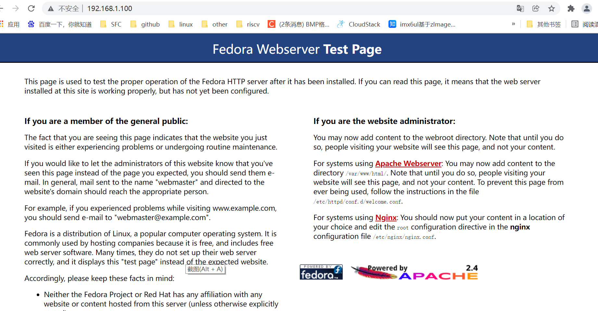
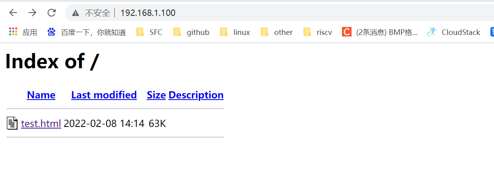

# web server fedora

1. **板卡执行如下命令安装和启动httpd**

   ```
   dnf install httpd
   systemctl start httpd
   firewall-cmd --add-service=http
   ```

   

2. **PC端用浏览器访问板卡IP**

   出现Fedora Webserver Test Page测试页面，说明搭建web server成功

   

3. **disable Test Page**

   To disable the test page, comment out all the lines in the file `/etc/httpd/conf.d/welcome.conf` using `#` as follows:

   ```
   # <LocationMatch "^/+$">
   #    Options -Indexes
   #    ErrorDocument 403 /.noindex.html
   # </LocationMatch>
   
   # <Directory /usr/share/httpd/noindex>
   #    AllowOverride None
   #    Require all granted
   # </Directory>
   
   # Alias /.noindex.html /usr/share/httpd/noindex/index.html
   ```

4. **拷贝网页到/var/www/html/目录下，PC端用浏览器访问板卡IP，即可显示自己添加的内容**

   


